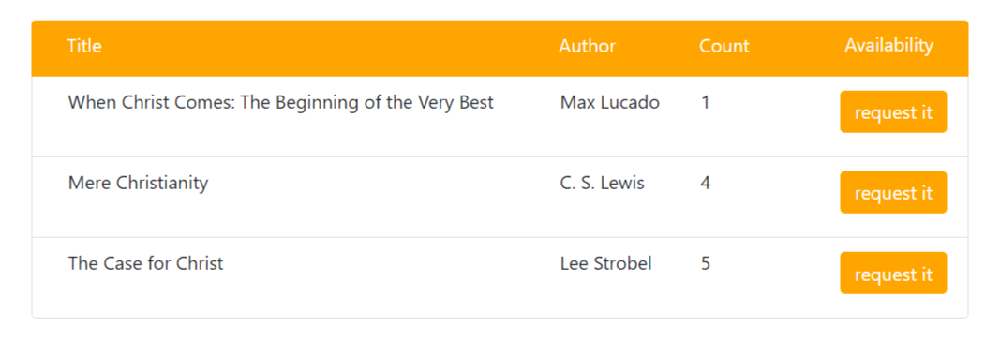
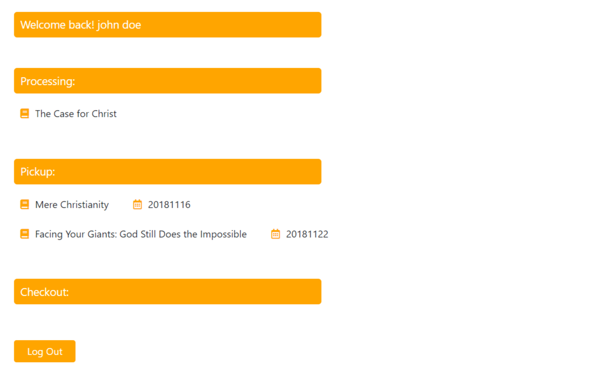

# HCNY Library System

HCNY has roughly 5,000 books. Most of them are religious books, written in English or Chinese. So far, the management of these books is not computerized. The borrow procedure is still very primitive, often leads to book lost. HCNYLS which stands for HCNY Library System is an online library system aiming at enabling the church to manage its books more efficiently by having features like categorizing and updating. It is also to help the church members to utilize the books more conveniently via online searching and ordering.

## User Interface

On the home page, there is a search bar for users to search books by their titles.

Based on the keywords, a number of relevant books would be retrieved from database and shown on the result page.

If certain book is available in the library, a user after successfully logging into his/her account could click on "request it" button to request the book.

A user must have an account in the library system so as to borrow books online. He/she could choose to create a new account by submitting the signup form.

The account page contains the basic info about the account and three list for the books that are in processing, the books that are ready to pick up, and the books that have been checked out respectively.

## Technology

HCNYLS is built up with MEAN stack. Angular 6.0 is used as front-end framework to make the UI more dynamic. By implementing the MVC design pattern, the single-page web application can simulate multi-page interaction very well. For back-end, since the relationship between each two tables in the database is not complicated and most of the data stored is book information, the document-oriented MongoDB is used as database. Besides, on top of JavaScript runtime environment Node.js, the web-app framework Express.js links up the front-end and back-end via API calls.

## Further Improvement

This application is still on the development stage. There are quite a few places to be improved in the future:

- Search books not only by book titles, but also by book authors, published years, or some other attributes.
- Filter search results by providing certain filtering options for each field.
- Record user search history and order history. Give recommendation according to user preference.
- Richer GUI with more interaction with end users and better user experience.

